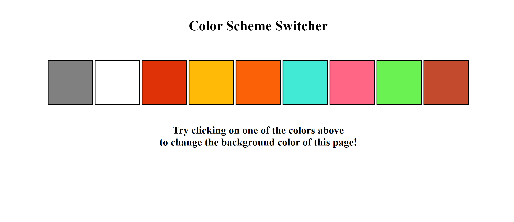

# Color-Scheme-Switcher 

## Description 
The **Color Scheme Switcher** is a simple web application built using **HTML, CSS, and JavaScript**. It allows users to dynamically change the background color of a webpage by clicking on different color options. The initial background color is set to white. 

## Installation 
- There is no installation required for this project. Simply open the index.html file in a web browser to view and interact with the Color Scheme Switcher.

## Usage 
- Open the index.html file in a web browser. 
- Click on any of the color options provided to change the background color of the page.
- The background color of the webpage will change immediately to the selected color.
- The chosen color will remain until the page is refreshed or closed.
